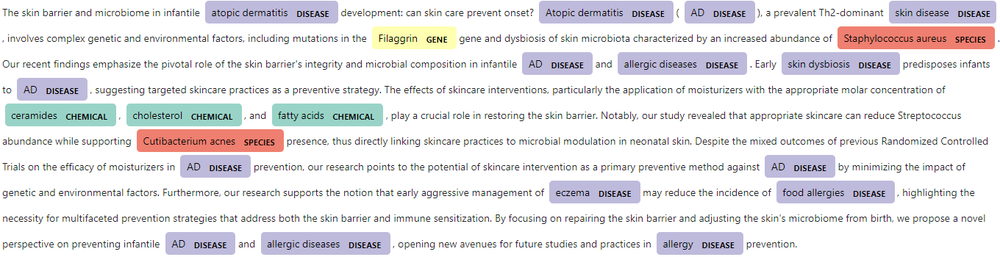

# AIObioEnts: All-in-one biomedical entities

Biomedical named-entity recognition following the all-in-one NER (AIONER) scheme introduced by [Luo *et al.*](https://doi.org/10.1093/bioinformatics/btad310). This is a straightforward Hugging-Face-compatible implementation without using a decoding head for ease of integration with other pipelines.

**Table of contents**

- [A note on language](#a-note-on-language)
- [Core biomedical entities](#core-biomedical-entities)
- [Additional biomedical entities](#additional-biomedical-entities)
- [Model files](#model-files)
- [Usage](#usage)
- [Visualisation](#visualisation)
- [References](#references)
- [Changelog](#changelog)


## A note on language

The key words "MUST", "MUST NOT", "REQUIRED", "SHALL", "SHALL NOT", "SHOULD", "SHOULD NOT", "RECOMMENDED", "MAY", and "OPTIONAL" in this document are to be interpreted as described in [RFC 2119](https://www.ietf.org/rfc/rfc2119.txt).

## Core biomedical entities

We have followed the original original AIONER training pipeline based on the BioRED dataset along with additional BioRED-compatible datasets:
- Gene: GNormPlus, NLM-Gene, DrugProt
- Disease: BC5CDR, NCBI Disease
- Chemical: BC5CDR, NLM-Chem, DrugProt
- Species: Species-800, Linnaeus
- Variant: tmVar
- Cell line: BioID

using three pre-trained language models as a base:
- [BiomedBERT-base pre-trained on both abstracts from PubMed and full-texts articles from PubMedCentral](https://huggingface.co/microsoft/BiomedNLP-BiomedBERT-base-uncased-abstract-fulltext)
- [BioLinkBERT-base](https://huggingface.co/michiyasunaga/BioLinkBERT-base)
- [BioLinkBERT large](https://huggingface.co/michiyasunaga/BioLinkBERT-large)


**F1 scores**

The F1 scores of the current implementation on the BioRED test set are shown below:

|               | **BiomedBERT-base abstract+fulltext** | **BioLinkBERT-base** | **BioLinkBERT-large** |
| ------------- | :-----------------------------------: | :------------------: | :-------------------: |
| **Cell line** |                 **96.97**                 |        79.60         |         91.49         |
| **Chemical**  |                 91.28                 |        90.93         |         **94.01**         |
| **Disease**   |                 87.87                 |        88.51         |         **88.55**         |
| **Gene**      |                 92.78                 |        93.12         |         **94.51**         |
| **Species**   |                 96.94                 |        96.68         |         **97.06**         |
| **Variant**   |                 86.60                 |        85.19         |         **88.57**         |
|  |  |  |  |
| **Overall**   |               91.26               |      91.11       |       **92.16**       |

We have used the original evaluation script provided in the 
[AIONER repository](https://github.com/ncbi/AIONER), which we provide here for completeness.

## Additional biomedical entities (in progress)

We will fine-tune the models using a modified version of the latest release of the [AnatEM](https://nactem.ac.uk/anatomytagger/#AnatEM) corpus, and a subset of entities that are of interest to us.

## Model files

All the trained models can be downloaded from Hugging Face.

### Core
- [BiomedBERT-base abstract+fulltext](https://huggingface.co/SIRIS-Lab/AIObioEnts-core-pubmedbert-full)
- [BioLinkBERT-base](https://huggingface.co/SIRIS-Lab/AIObioEnts-core-biolink-base)
- [BioLinkBERT-large](https://huggingface.co/SIRIS-Lab/AIObioEnts-core-biolink-large)

### AnatEM (in progress)

## Usage

**Inference**

The models can be directly used from HuggingFace in a NER pipeline. However, we note that, since additional `'O'` labels are used in the scheme, the outputs should be postprocessed. We provide [helper functions](./src/tagging_fn.py) to tag individual texts:

````python
from tagging_fn import process_one_text
from transformers import pipeline

pipe = pipeline('ner', model='SIRIS-Lab/AIObioEnts-core-pubmedbert-full', aggregation_strategy='none', device=0)

process_one_text(text_to_tag, pipeline=pipe, entity_type='ALL')
````

Alternatively, you may use the provided script to tag a collection of texts in `pubtator` or `jsonl` format.

````bash
python tag_collection.py -t collectionType -i inputFile -o outputFile -m trainedModel -e entityType
````
Here, the trained model path may be either a HF model or your own local path. For `jsonl` input, the data is assumed to have an id and a text field, in that order. The output file will contain these 2 fields plus `'label'`, corresponding to a list of lists of the form `[start_index, end_index, entity_type]` for each of the texts.

**Training a model**

To retrain your own model using the same or other data, you can use

````bash
python train_model.py -m pretrainedModel -d dataDir -v vocab -o outputDir -l learningRate -n nEpochs
````
Here, the input data is assumed to be in `jsonl` format as above, including the annotations as lists of lists, and the `vocab` file contains the AIONER labels.

The [preprocessing script](./src/process_training_data.py) provides a function to transform `pubtator` data into `jsonl`.

**Fine-tuning (in progress)**


## Visualisation

We provide an [example notebook](./notebooks/visualise_examples.ipynb) to visualise model outputs on plain text using a sample from a collection of title+abstract from [500 recent PubMed publications](./data/PubMed_Jun24/PubMed_Jun24.csv).



## Dependencies

The processing, training and inference scripts have been tested with
````
transformers==4.45.2
spacy==3.7.2
datasets==3.0.1
evaluate==0.4.3
numpy==2.1.3
pandas==2.2.3
tqdm==4.66.5
````

Additionally, the visualisation notebook requires `ipymarkup` (tested on `v0.9.0`).

## References

[[1] Ling Luo, Chih-Hsuan Wei, Po-Ting Lai, Robert Leaman, Qingyu Chen, and Zhiyong Lu. "AIONER: All-in-one scheme-based biomedical named entity recognition using deep learning." Bioinformatics, Volume 39, Issue 5, May 2023, btad310.](https://doi.org/10.1093/bioinformatics/btad310)

## Changelog

All notable changes to this project will be documented in the 📝 [CHANGELOG](CHANGELOG.md) file, and this project adheres to [Semantic Versioning](https://semver.org/spec/v2.0.0.html).
